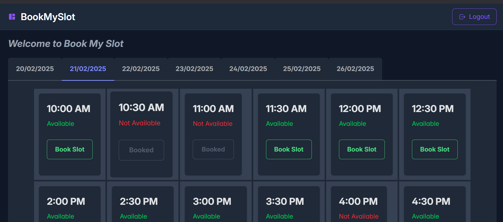
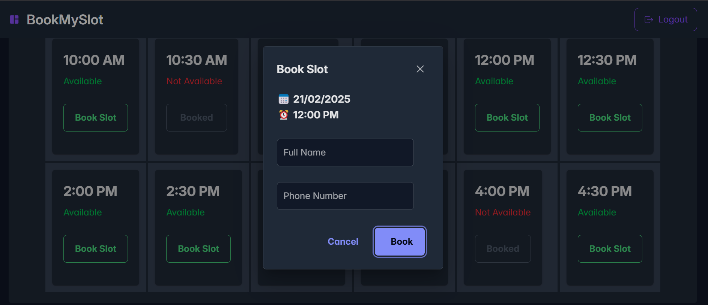

# slot-booking-App

This is a frontend for an appointment slot booking system.

  <div>
    
    
    
  </div>

 
 

## 📋 <a name="table">Table of Contents</a>

1. 🤖 [Introduction](#introduction)
2. ⚙️ [Tech Stack](#tech-stack)
3. 🔖 [Quick Start](#quick-start)

## 🤖 <a name="introduction">Introduction</a>

This is a frontend for an appointment slot booking system.

## ⚙️ <a name="tech-stack">Tech Stack</a>

- React.js
- Vite.js
- Tailwind CSS
- Primereact


## 🔖 <a name="quick-start">Quick Start</a>

Follow these steps to set up the project locally on your machine.

**Prerequisites**

Make sure you have the following installed on your machine:

- [Git](https://git-scm.com/)
- [Node.js](https://nodejs.org/en)
- [npm](https://www.npmjs.com/)

**Cloning the Repository**

```bash
git clone https://github.com/abdulvahabaa/slot-booking-App.git
cd slot-booking-App
```

**Installation**

Install the project dependencies using npm:

```bash
npm install
```

**Running the Project**

```bash
npm run dev
```

This will start the development server and open the application in your default browser at `http://localhost:5173`.

**Building the Project**

```bash
npm run build
```

This will create a production build of the application in the `dist` directory.

